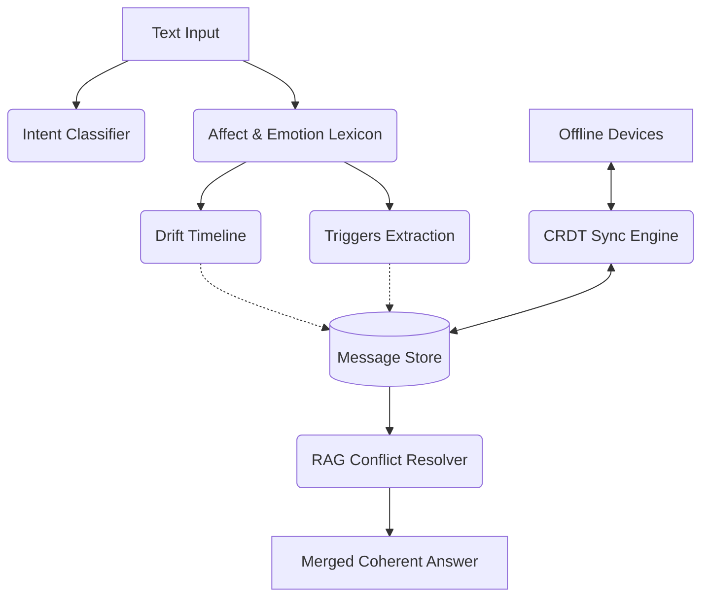

<div align="center">
  <h1>🌌 Kastack AI Chat</h1>
  <p><strong>Intelligent RAG System + Persona Extraction over 11,000+ Conversations</strong></p>
  
  [](https://lassanmonster-kastack-chat.hf.space)
  [](https://fastapi.tiangolo.com/)
  [](https://reactjs.org/)
  [](https://www.docker.com/)
</div>

<br />

## 🔗 Live Demo

**Chatbot URL:** [https://lassanmonster-kastack-chat.hf.space](https://lassanmonster-kastack-chat.hf.space)

---

## 📖 Overview

Kastack AI Chat is a full-stack RAG (Retrieval-Augmented Generation) system that processes 191,592 messages across 11,001 conversation days. It detects topic changes chronologically, creates 100-message checkpoint summaries, extracts user personas, and answers natural language queries using grounded retrieval.

### 🔄 Round 2 Features
Round 2 of the Kastack architecture introduces continuous context, shifting emotional arcs, intent-based routing, and a multi-device data sync layer. Instead of a basic vector search over isolated documents, this architecture treats user history as a living stream of evolving sentiments, allowing the assistant to understand both **what** was said and **how feelings changed over time**. It includes four primary subsystems: Intent Classification, Affect & Drift Detection, RAG Conflict Resolution, and Offline CRDT Sync.



---

## 🧠 How Topic Change Detection Works

### Methodology: Sliding-Window Cosine Similarity with Adaptive Thresholding

Topic detection processes messages **strictly in chronological order** and uses embedding-based similarity to detect when the conversation shifts to a new subject.

#### Step-by-step:

1. **Embed every message** using `all-MiniLM-L6-v2` (384-dim sentence embeddings).

2. **Compute consecutive cosine similarities** between adjacent message embeddings:
   ```
   sim[i] = cosine(embedding[i], embedding[i+1])
   ```

3. **Apply sliding-window mean smoothing** (window size = 5) to reduce noise from single-message outliers.

4. **Detect topic boundaries** where the smoothed similarity **drops below** `mean - 1.5 * std_dev`. This adaptive threshold adjusts to the natural variation in each conversation rather than using a fixed cutoff.

5. **Enforce conversation boundaries**: A topic segment **never spans across different conversations**. If conversation ID changes, a new topic always starts regardless of similarity.

6. **Minimum segment size**: Segments shorter than 4 messages are merged with adjacent segments to avoid over-fragmentation.

#### Output format:
```
Topic 1 → messages 1-25 → "Users discussed hiking in the Everglades and wildlife photography"
Topic 2 → messages 26-60 → "Conversation shifted to career plans and software engineering"
Topic 3 → messages 61-90 → "Discussion about family relationships and weekend plans"
```

**Total topics detected: ~24,000 across all conversations.**

The implementation is in [`pipeline/topic_detector.py`](pipeline/topic_detector.py).

---

## 🔍 How Retrieval Works (RAG System)

When a user asks a question, the system performs **multi-layered retrieval** to find the most relevant context:

### Layer 1: Topic Summary Retrieval (Top-3)
- All topic summaries are pre-embedded using `all-MiniLM-L6-v2`
- The user query is embedded and compared via cosine similarity
- The **top 3 most relevant topic summaries** are retrieved

### Layer 2: Checkpoint Summary Retrieval (Top-2)
- Every 100 messages (chronological) has a pre-computed summary
- **1,916 checkpoint summaries** cover the entire dataset
- The **top 2 most relevant checkpoint summaries** are retrieved

### Layer 3: Exact Message Retrieval (Top-10)
- The query embedding is compared against all 191K message embeddings
- The **top 10 most similar individual messages** are retrieved
- Optional filtering by sender (User 1 / User 2) or by topic

### Answer Generation
All retrieved context (topic summaries + checkpoint summaries + exact messages) is combined into a structured prompt and fed to `google/flan-t5-small` for answer generation.

A **confidence threshold of 0.30** cosine similarity is enforced - if no messages are sufficiently relevant, the system declines to answer rather than hallucinating.

### Persona-Aware Routing
Questions about personality, habits, or communication style (e.g., "What kind of person is User 1?") are automatically routed to the **pre-computed persona data** instead of the RAG pipeline, ensuring accurate statistical answers rather than LLM-generated guesses.

The implementation is in [`backend/rag_engine.py`](backend/rag_engine.py).

---

## 👤 How Persona is Built

Persona extraction uses **pure statistical analysis and regex pattern matching** - no LLM inference. This ensures all persona data is backed by actual conversation signals, not guesses.

### What is extracted:

#### 1. Communication Style
| Metric | Method |
|--------|--------|
| Avg message length | Character count statistics |
| Exclamation rate | `!` frequency per message |
| Question rate | `?` frequency per message |
| Emoji usage rate | Unicode emoji detection |
| Messages per conversation | Count aggregation |

#### 2. Habits
| Habit | Detection Method |
|-------|-----------------|
| Late sleeper | Content regex: "stay up late", "can't sleep", "up all night" |
| Early bird | Content regex: "wake up early", "morning person", "early riser" |
| Weekend active | Weekend vs weekday keyword mentions |
| Brief/verbose communicator | Message length distribution analysis |

#### 3. Personality Traits
| Trait | Signal |
|-------|--------|
| Curious | Question rate > 15% of messages |
| Enthusiastic | Exclamation rate > 20% of messages |
| Funny | Laughter indicators (haha, lol, lmao) > 5% |
| Expressive | Emoji usage rate > 10% |
| Formal/Casual | Avg message length + slang frequency |

#### 4. Personal Facts
- **Job mentions**: Regex patterns like "I am a [job]", "I work as a [job]"
- **Location mentions**: "I live in [place]", "I'm from [place]"
- **Relationship mentions**: Family terms (mom, dad, sister, brother, partner, etc.)
- **Hobby mentions**: "I like to [hobby]", "I enjoy [hobby]"
- **Pet mentions**: Dog, cat, etc. keyword frequency

### Output format (JSON):
```json
{
  "persona_user_1": {
    "total_messages_analyzed": 98079,
    "communication_style": {
      "avg_message_length": 55.3,
      "exclamation_rate": 0.523,
      "question_rate": 0.271
    },
    "personality_traits": {
      "curious": {"detected": true, "rate": 0.271},
      "enthusiastic": {"detected": true, "rate": 0.523}
    },
    "personal_facts": {
      "job_mentions": {"teacher": 138, "software engineer": 105},
      "location_mentions": {"a small town in the Midwest": 53, "California": 38}
    }
  }
}
```

The implementation is in [`pipeline/persona_extractor.py`](pipeline/persona_extractor.py).

---

## 🏗️ Tech Stack

| Component | Technology |
|-----------|-----------|
| **Backend** | FastAPI, Python 3.10 |
| **ML Models** | `all-MiniLM-L6-v2` (embeddings), `google/flan-t5-small` (generation) |
| **Summarization** | `sshleifer/distilbart-cnn-12-6` (offline pipeline) |
| **Frontend** | React 18, Vite, Tailwind CSS, Framer Motion |
| **SSR** | Nitro (node-server preset) |
| **Deployment** | Docker, Hugging Face Spaces |

---

## 📂 Project Structure

```
Kastack/
├- pipeline/                    # Data processing pipeline
│   ├- preprocess.py            # CSV → JSONL cleaning
│   ├- embeddings.py            # Message embedding (all-MiniLM-L6-v2)
│   ├- topic_detector.py        # Chronological topic detection
│   ├- persona_extractor.py     # Statistical persona extraction
│   └- summarizer.py            # Topic + checkpoint summarization
├- backend/
│   ├- app.py                   # FastAPI endpoints + SSR proxy
│   └- rag_engine.py            # RAG retrieval + answer generation
├- frontend/
│   └- src/                     # React + Vite application
├- data/
│   ├- raw/conversations.csv    # Original dataset
│   └- processed/               # Pipeline outputs
│       ├- embeddings.npy       # 191K × 384 embedding matrix (280 MB)
│       ├- embedding_index.json # Array position → message ID mapping
│       ├- processed_messages.jsonl
│       ├- topic_segments.json  # ~24K topics with summaries
│       ├- summaries.json       # 1,916 checkpoint summaries
│       └- persona.json         # User 1 & User 2 persona profiles
├- Dockerfile
├- start.sh
└- requirements.txt
```

---

## 🚀 Getting Started (Local Development)

### Prerequisites
- Python 3.10+
- Node.js 18+
- Git LFS

### 1. Clone & Install
```bash
git clone https://github.com/Krish-kukreja/task_intern.git
cd task_intern

# Python dependencies
pip install -r requirements.txt

# Frontend dependencies
cd frontend && npm install && cd ..
```

### 2. Run the Pipeline (if starting from scratch)
```bash
python pipeline/preprocess.py
python pipeline/embeddings.py
python pipeline/topic_detector.py
python pipeline/persona_extractor.py
python pipeline/summarizer.py
```

### 3. Run Locally (Round 1 FastAPI + React)
```bash
# Terminal 1: Frontend dev server
cd frontend && npm run dev

# Terminal 2: Backend
cd backend && uvicorn app:app --reload --port 7860
```

### 4. Run Round 2 Features
To test the Offline Intent Classifier, Persona Drift, and RAG Conflict Resolution from Round 2:
```bash
# Run the Streamlit demo dashboard
python -m streamlit run backend/round2/app.py

# Run the automated test suite for Round 2
python -m pytest backend/round2/tests -v
```

### Data Caveat for Round 2
The PersonaChat dataset consists of disconnected day-to-day chats where "days" are actually separate pairs of people talking. Treating it as a single continuous user history is biologically/socially incorrect and results in massive topical and emotional whiplash. The Round 2 drift engine has been validated instead on a curated synthetic Demo Arc and real WhatsApp/Telegram exports.

---

## ☁️ Deployment

Deployed on **Hugging Face Spaces** using Docker.

The `Dockerfile` builds the React frontend with Nitro SSR, installs Python dependencies, and `start.sh` launches both the Node.js SSR server (port 3000) and FastAPI backend (port 7860).

Pre-computed data files are tracked via Git LFS - no pipeline re-run needed on deployment.

---

<div align="center">
  <p>Built with ❤️ by Krish Kukreja</p>
</div>
